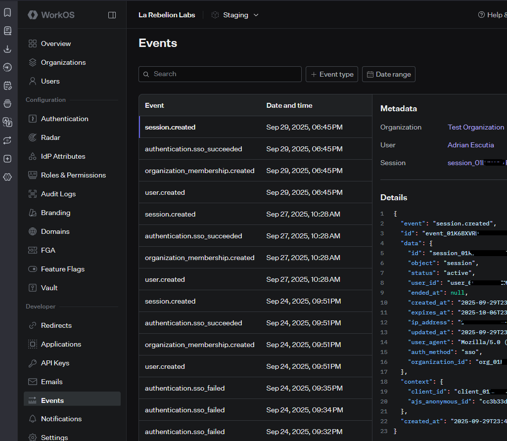

import ReactPlayer from 'react-player'

# Integrate WorkOS with MCP Servers

This guide explains how to add WorkOS authentication to MCP servers using an API-first approach. You will deploy authentication directly from an OpenAPI (Swagger) specification without writing backend code.

## Introduction

WorkOS provides enterprise authentication for applications. MCP servers require authentication to secure MCP Tools and user access. This guide shows how to connect [**WorkOS**](https://workos.com/) authentication to MCP servers using OpenAPI specifications and the [**HAPI server**](https://docs.mcp.com.ai/components/hapi-server/).

## Prerequisites

Before you begin, ensure you have the following:

* A WorkOS account with an organization.
* A WorkOS application with Dynamic Client Registration (DCR) enabled.
* The [HAPI server CLI](https://hapi.mcp.com.ai) installed.
* An [OpenAPI (Swagger) specification v3](https://swagger.io/specification/v3/) for your API.
* MCP Inspector or any MCP client application supporting [authorization flow](https://modelcontextprotocol.io/specification/2025-06-18/basic/authorization#authorization-flow).

## Configure WorkOS

You must configure WorkOS to enable authentication for your MCP server.

1. Create an organization and add users in WorkOS.
2. Create a [WorkOS application](https://workos.com/docs/authkit/example-apps) and [enable Dynamic Client Registration](https://workos.com/docs/authkit/mcp/integrating/enabling-dynamic-client-registration) (DCR).
3. Set up [redirect URIs](https://workos.com/docs/sso/redirect-uris) to the Application (MCP Inspector or your MCP client).

:::tip
> Dynamic Client Registration allows MCP servers to register applications in WorkOS automatically if no client ID is provided.
:::

## Define API Security in OpenAPI Specification

```yaml
```

Extend your OpenAPI specification to include authentication and CORS settings.

1. Add a [security definition for OAuth2](https://swagger.io/specification/v3/#oauth-flows-object), specifying the client ID, authorization URL, and token URL.
2. Configure [CORS](https://developer.mozilla.org/en-US/docs/Web/HTTP/Guides/CORS) to allow requests from the MCP Client.

:::tip
WorkOS provides a `.well-known` authorization endpoint.
If your API does not provide a `.well-known` authorization endpoint, HAPI server generates one automatically.
:::

## Start the MCP Server

Start the MCP server using your OpenAPI specification.

```bash
hapi serve demo -f "api.yaml" --headless
# or
hapi serve https://docs.mcp.com.ai/apis/openapi/demo.yaml -f "api.yaml" --headless
```

Example files:
- [demo.yaml](./examples/demo.yaml) - the OAS dummy demo
- [api.yaml](./examples/api-to-mcp.yaml) - the security extension

This command loads your API spec with security and runs the MCP server in `headless` mode for backend integration.

## Connect MCP Server to WorkOS

You can authorize Apps (MCP Clients) with WorkOS (Authorization Server) in two ways:

### Authenticate with Client ID

1. Provide the WorkOS client ID in your configuration.
2. Users log in through WorkOS (for example, only users from `@example.com`).
3. MCP application Client is approved.

### Authenticate with Dynamic Registration

1. Remove the client ID from your configuration.
2. Start the authentication process.
3. WorkOS automatically registers a new application for your MCP.

WorkOS creates a new application entry (such as "MCP Inspector") without manual dashboard changes.

## Review Authentication in WorkOS

After authentication, verify the following [events in the WorkOS dashboard](https://dashboard.workos.com):

* Users are authenticated successfully.
* Applications is dynamically created, if using DCR.



## Demo Authentication with WorkOS

<ReactPlayer 
  style={{ width: '80%', height: 'auto', aspectRatio: '4/3' }}
  controls
  src='https://youtu.be/S2_Z0rbnOH8'
></ReactPlayer>

---

## Wrapping Up

You have integrated WorkOS authentication with MCP servers using OpenAPI specifications and the HAPI server. This approach enables secure, API-driven deployments without backend code.

You can now deploy MCP servers with authentication quickly and efficiently.

With the **HAPI Server**, you can:

* Deploy MCP servers straight from **OpenAPI specifications (OAS)**.
* Add authentication via **WorkOS**.
* Do it all **without writing a single line of backend code**.

This makes it incredibly fast to go from API spec → secure MCP server.

:::note
> To request integration with another API or authentication provider, contact the team.
:::

---

_Be-HAPI_ and go rebels! ✊🏽

