# Core Engine Orchestrator

The Core Engine Orchestrator is the central component that manages the complex workflow between users, MCP hosts, agents, and tools. It handles parameter validation, multi-agent coordination, and ensures smooth execution of tasks across the entire system.

## Architecture Overview

```mermaid
graph TD
    User[👤 User] -->|Query| MCPHost[🏠 MCP Host<br/>chatMCP]
    
    MCPHost -->|Get Available Tools| MCPServers[🔧 MCP Servers<br/>OS, API, Code]
    MCPServers -->|Tool List| MCPHost
    
    MCPHost -->|Query + Tools| CoreOrchestrator{🎯 Core Engine<br/>Orchestrator}
    
    %% Decision: Single vs Multi-agent
    CoreOrchestrator -->|Analyze Query| AgentDecision{Agent Selection}
    AgentDecision -->|Single Task| SingleAgent[🤖 Single Agent]
    AgentDecision -->|Complex/Group Task| MultiAgent[👥 Multi-Agent<br/>Group Chat]
    
    %% Single Agent Flow
    SingleAgent -->|Request Tool| LLM[🧠 LLM]
    LLM -->|Tool Selection| ToolValidator{🔍 Tool Validator}
    
    %% Parameter Validation
    ToolValidator -->|Check Params| ParamDecision{Parameters<br/>Complete?}
    ParamDecision -->|❌ Missing| ParamCollector[📝 Parameter<br/>Collector]
    ParamCollector -->|Request Input| User
    User -->|Provide Params| ParamCollector
    ParamCollector -->|Validated Params| ToolValidator
    
    ParamDecision -->|✅ Complete| ToolExecution[⚡ Tool Execution]
    ToolExecution -->|Results| ResultProcessor[📊 Result Processor]
    ResultProcessor -->|Response| User
    
    %% Multi-Agent Flow
    MultiAgent -->|Coordinate| AgentPool[🎭 Agent Pool]
    AgentPool -->|Agent A| AgentA[🤖 Agent A]
    AgentPool -->|Agent B| AgentB[🤖 Agent B]
    AgentPool -->|Agent N| AgentN[🤖 Agent N]
    
    %% Agent Coordination
    AgentA -->|Tool Request| GroupToolValidator{🔍 Group Tool<br/>Validator}
    AgentB -->|Tool Request| GroupToolValidator
    AgentN -->|Tool Request| GroupToolValidator
    
    GroupToolValidator -->|Validate & Queue| TaskQueue[📋 Task Queue]
    TaskQueue -->|Execute| ToolExecution
    
    %% Agent Communication
    AgentA -.->|Collaborate| AgentB
    AgentB -.->|Share Context| AgentN
    AgentN -.->|Feedback| AgentA
    
    %% Orchestrator Monitoring
    CoreOrchestrator -.->|Monitor| SingleAgent
    CoreOrchestrator -.->|Monitor| MultiAgent
    CoreOrchestrator -.->|Manage| TaskQueue
    
    %% Error Handling
    ToolExecution -->|Error| ErrorHandler[❌ Error Handler]
    ErrorHandler -->|Retry Logic| ToolValidator
    ErrorHandler -->|Fatal Error| User
    
    %% Context Management
    CoreOrchestrator -->|Store Context| ContextStore[(🗃️ Context Store)]
    ContextStore -->|Retrieve Context| CoreOrchestrator
    
    %% Styling
    classDef userClass fill:#e1f5fe
    classDef orchestratorClass fill:#f3e5f5
    classDef agentClass fill:#e8f5e8
    classDef toolClass fill:#fff3e0
    classDef decisionClass fill:#ffebee
    
    class User userClass
    class CoreOrchestrator,ContextStore orchestratorClass
    class SingleAgent,MultiAgent,AgentA,AgentB,AgentN,AgentPool agentClass
    class MCPServers,ToolExecution,ToolValidator,GroupToolValidator toolClass
    class AgentDecision,ParamDecision decisionClass
```

## Key Components

### 🎯 Core Engine Orchestrator
- **Query Analysis**: Determines task complexity and required agent configuration
- **Agent Selection**: Decides between single-agent or multi-agent execution
- **Parameter Management**: Ensures all required parameters are collected and validated
- **Context Management**: Maintains conversation state and agent memory
- **Error Handling**: Manages failures and retry logic

### 🔍 Parameter Validation Flow
1. **Tool Selection**: LLM identifies the appropriate tool for the task
2. **Parameter Check**: Validator examines if all required parameters are present
3. **Parameter Collection**: If missing, prompts user for additional input
4. **Validation Loop**: Continues until all parameters are satisfied
5. **Execution**: Proceeds with tool execution once validation passes

### 👥 Multi-Agent Coordination
- **Agent Pool Management**: Dynamically assigns agents based on task requirements
- **Task Queue**: Manages concurrent tool requests from multiple agents
- **Inter-Agent Communication**: Enables collaboration and context sharing
- **Group Tool Validation**: Ensures tool requests don't conflict in group scenarios

### 📊 Execution Monitoring
- **Real-time Tracking**: Monitors all active tasks and agent states
- **Resource Management**: Prevents conflicts and optimizes resource usage
- **Context Preservation**: Maintains conversation history across agent switches
- **Performance Metrics**: Tracks execution times and success rates

## Benefits

- **🚀 Enhanced User Experience**: Seamless parameter collection without manual intervention
- **🤝 Multi-Agent Collaboration**: Enables complex tasks requiring multiple specialized agents
- **🛡️ Robust Error Handling**: Graceful failure recovery and user notification
- **📈 Scalability**: Supports growing complexity in agent interactions
- **🔄 Context Continuity**: Maintains conversation flow across different execution paths

@note The orchestrator acts as the central nervous system, ensuring all components work together harmoniously while providing a smooth user experience.

