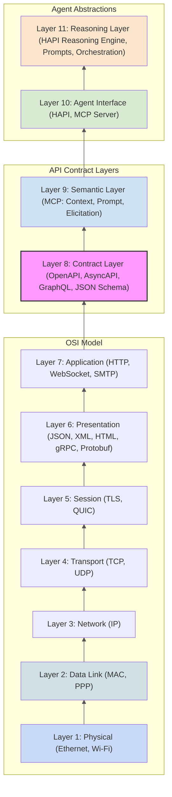
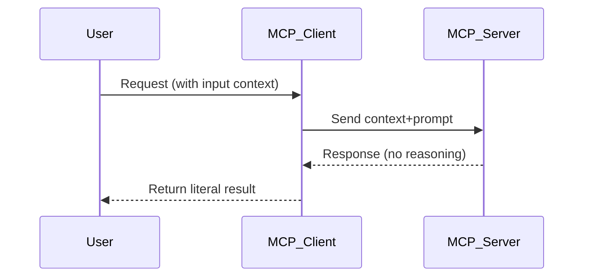
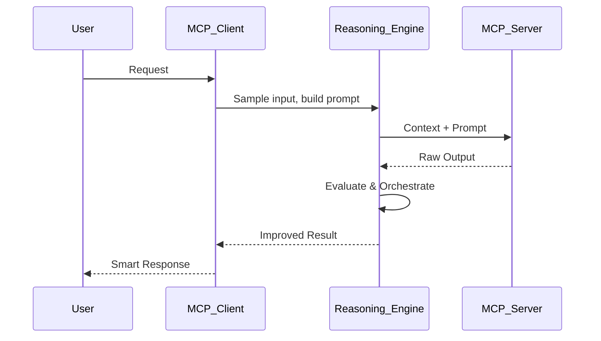

import Mermaid from '@theme/Mermaid';

# 🧠 MCP, Smart Agents, and the OSI Model

**The Model Context Protocol (MCP)** introduces a new semantic dimension to traditional systems integration, enabling both humans and machines **to interact with AI** in smarter, contextual ways. But to truly understand its role and value, we need to ground it in what we already know—the [OSI model](https://en.wikipedia.org/wiki/OSI_model).

## 📊 Mapping MCP to the OSI Model

We’ve extended the OSI model to show where MCP fits and how it layers semantics, contracts, and API intent on top of existing web infrastructure:

### ✅ What’s new?

- **Layer 8**: Contract definitions—what the API can do (OpenAPI, GraphQL, etc.)
- **Layer 9**: MCP brings **semantic meaning**—what the API means, how it should be used based on **Context**.
- **Layer 10–11**: With **HAPI**, we transform dumb agents into smart, orchestrated entities by adding **intent, reasoning, and memory**.

MCP is not just another protocol; it’s a **semantic layer** that enables **intelligent API interactions**. It allows agents to understand not just the data, but the **intent and context** behind it.

---

## 🧱 Dumb vs Smart Agents in MCP

Not all agents are created equal. We define three key types of agents in the MCP ecosystem:

- **Dumb Agents**: These agents simply consume APIs without understanding context or intent. They return literal outputs based on the API contract. They are like traditional web services—they do what they’re told, but they don’t reason about the interaction (unless explicitly programmed to do so - algorithmically).
- **Smart Agents**: These agents use MCP to reason about the context, ask clarifying questions, and orchestrate multiple API calls intelligently. MCP enables this by providing a structured way to manage context, prompts, and elicitation. They can sample inputs, retry actions, and adapt their behavior based on user interactions and system state.
- **HAPI Agents**: These are advanced smart agents that can manage complex workflows, maintain long-term memory, and adapt their behavior based on user interactions and system state.

In a raw MCP setup:

- You have an **MCP Client** and an **MCP Server**.
- These two communicate over semantically described APIs, but they do not **reason** about the interaction. They rely on the existing context and return literal outputs.

This is the **Dumb Agent** model.

Now let’s level up.

### 🤖 Enter Smart Agents with HAPI Agents

The **HAPI Stack** brings **sampling, elicitation, and orchestration** to life:

- Smart agents can ask clarifying questions.
- They can **re-sample** the input, compare results, or retry based on conditions.
- They **reason** over responses, not just return them.

This transforms API consumption from a static query-response model into an adaptive conversation.

---

## 🔎 Key Concepts: Sampling and Elicitation

These two HAPI mechanisms power **smart behavior**:

### 🧪 Sampling

> _"Sampling allows the client to evaluate and retry responses to improve outcomes."_  
→ Think of this as **re-generating** a better result based on heuristics, thresholds, or user expectations.

📚 [Learn more → Sampling](https://modelcontextprotocol.io/docs/learn/client-concepts#sampling)

### ❓ Elicitation

> _"Elicitation enables the system to ask for more information when the prompt or context is insufficient."_  
→ Think of it as a **clarifying question** before a bad answer is given.

📚 [Learn more → Elicitation](https://modelcontextprotocol.io/docs/learn/client-concepts#elicitation)

---

## 🧠 Why Smart Agents Matter for the Future of APIs

APIs today are dumb endpoints. They do what they’re told, even when it doesn’t make sense.

With the **MCP + HAPI Stack**, we move towards a new paradigm:

| Capability        | Dumb Agent           | Smart Agent                 |
|------------------|-----------------------|-----------------------------|
| Uses contract    | ✅ Yes               | ✅ Yes                      |
| Adds context     | ✅ Minimal           | ✅ Extensive (MCP Context)  |
| Understands intent | ❌ No              | ✅ Yes                      |
| Can retry intelligently | ❌ No         | ✅ With sampling            |
| Can clarify prompts | ❌ No             | ✅ With elicitation         |
| Can orchestrate APIs | ❌ No            | ✅ Yes                      |

---

## 💬 Final Thoughts

The OSI Model taught us **how** computers talk.

MCP teaches us **how they understand**.

The **HAPI stack** gives us the final missing piece: **how they reason**.

Together, we’re no longer building static APIs—we're building **agentic systems** capable of real-time context awareness, adaptive decision-making, and rich user interaction.

So the next time you wrap an OpenAPI spec in an MCP Server—know this:

> You just built a Dumb Agent.

But when you layer in reasoning, memory, and intent with HAPI—

> You’ve built a Smart Agent. 🧠

---

## 🛠️ Want to try it?

- Spin up an MCP server in < 1 min with [HAPI](https://hapi.run)
- Use `runMCP` to create Smart API interfaces
- Orchestrate your first Smart Agent with [GYAT](https://apicove.com)

## Further Reading

- [Model Context Protocol (MCP)](https://modelcontextprotocol.io)
- [Elicitation](https://modelcontextprotocol.io/docs/learn/client-concepts#elicitation)
- [Resources & Context Data](https://modelcontextprotocol.io/docs/learn/server-concepts#resources-context-data)
