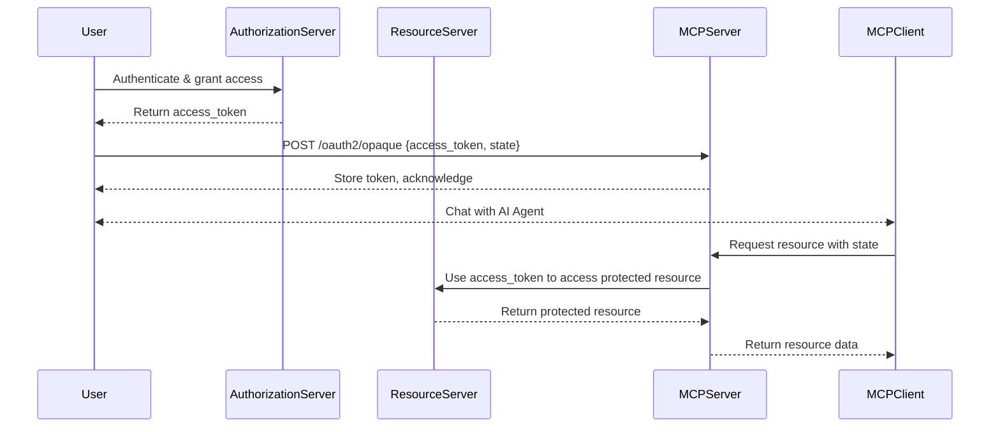

# Known Issues in HAPI Server OpenAPI Integration

HAPI server's OpenAPI integration is robust, but like any complex system, it has some known issues and limitations. This document outlines these issues to help you navigate them effectively.

## Cannot create route with parameter name conflict

When defining routes in HAPI server using OpenAPI specifications, you may encounter an error related to parameter name conflicts. This typically occurs when two routes share the same path but use different parameter names.

### Snippet of OpenAPI Specification

```yaml
openapi: 3.0.0
# ... rest of the OpenAPI specification removed for brevity
paths:
  /background-checks:
    get:
      summary: Retrieve Background Checks
      responses:
        '200':
          description: Successful retrieval of background checks
        '401':
          description: Unauthorized access
        '404':
          description: Background checks not found
  /background-checks/{resourceId}/records:
    get:
      summary: Retrieve Background Check Records
      parameters:
        - name: resourceId          # <-- Ensure consistent parameter name here 👇🏽
          in: path
          required: true
          schema:
            type: string
      responses:
        '200':
          description: Successful retrieval of records
        '400':
          description: Bad request due to invalid parameters
  /background-checks/{id}/pdf:
    get:
      summary: Retrieve Background Check PDF
      parameters:
        - name: id                  # <-- Ensure consistent parameter name here 👆🏽
          in: path
          required: true
          schema:
            type: string
# ... rest of the OpenAPI specification removed for brevity
```

### Error:

```bash
2025-08-13 19:42:35 [ERROR]: Failed to start server: Cannot create route "/background-checks/:resourceId/records" with parameter "resourceId" because a route already exists with a different parameter name ("id") in the same location
2025-08-13 19:42:35 [ERROR]: Error: Cannot create route "/background-checks/:resourceId/records" with parameter "resourceId" because a route already exists with a different parameter name ("id") in the same location
```

### Cause

A path in the OpenAPI specification can be defined with static or dynamic parameters. For scenarios where the path is dynamic, such as `/background-checks/{id}/records`, it is crucial to ensure that the parameter names in the OpenAPI specification for all dynamic paths in common are consistent, otherwise, it can lead to errors initializing the HAPI server or unexpected behavior during API calls.

For example, given two paths:
- `/background-checks/{id}/records`
- `/background-checks/{resourceId}/records`

If the OpenAPI specification defines these paths with different parameter names, it can lead to conflicts when HAPI server attempts to create routes. This is because HAPI server expects consistent parameter names across similar paths to avoid ambiguity in routing.

### Solution

To resolve this issue, ensure that all dynamic parameters in your OpenAPI specification are consistently named across similar paths. For instance, if you have a path like `/background-checks/{id}/records`, ensure that any other path that refers to the same resource uses the same parameter name (`id` in this case).

## Please encode all non-ASCII characters

When working with OpenAPI specifications in HAPI server, it is important to ensure that all non-ASCII characters are properly encoded. This is particularly relevant for paths, parameters, and other elements that may contain special characters.

### Snippet of OpenAPI Specification

```yaml
openapi: 3.0.0
# ... rest of the OpenAPI specification removed for

paths:
  /entities/{entityId}/datasources/mx/buro-de-credito/reports:
    get:
      tags:
        - DS MX Buró de Crédito Reports                 # <-- Non-ASCII characters 'é' and 'ó' in 'Buró de Crédito'
      operationId: GetEntityMxBuroDeCreditoReports
      summary: Get an entity's Buró de Crédito reports  # <-- Non-ASCII character 'é' and 'ó' in 'Buró de Crédito'
# ... rest of the OpenAPI specification removed for brevity
```

### Error:

```bash
2025-08-14 07:31:30 [ERROR]: Failed to start server: Invalid route "/entities/:entityId/datasources/mx/buro-de-credito/reports". Please encode all non-ASCII characters in the path.
2025-08-14 07:31:30 [ERROR]: TypeError: Invalid route "/entities/:entityId/datasources/mx/buro-de-credito/reports". Please encode all non-ASCII characters in the path.
```

### Cause

The error occurs when the HAPI server encounters a route with non-ASCII characters in its path or it's underlying objects. HAPI server requires that all paths be encoded to ensure proper routing and handling of requests. Non-ASCII characters can lead to issues in URL parsing and routing, which is why they must be encoded.

### Solution

To resolve this issue, ensure that all non-ASCII characters in your OpenAPI specification are properly encoded. For example, if you have a path like `/entities/:entityId/datasources/mx/buro-de-credito/reports`, you should encode the non-ASCII characters (like `é`) to their percent-encoded equivalents.

Other options include using Command-Line Tools:

**`tr` command**: This command can be used to delete characters outside the ASCII range.

```bash
LC_ALL=C tr -dc '\0-\177' < input_file > output_file
```

* LC_ALL=C: Ensures that character handling is based on the C locale, treating each byte as a distinct character, which is crucial for correct ASCII handling.
* -d: Deletes characters.
* -c: Complements the set of characters, meaning it considers characters not in the specified range.
* '\0-\177': Represents the octal range for ASCII characters (0 to 127).
* < input_file: Specifies the input file.
* > output_file: Redirects the output to a new file.

**`cat` and `grep` command**: These commands can be used together to filter out non-ASCII characters.

```bash
cat -v input_file.yaml | grep M-CM
```

This command will display the contents of `input_file.yaml`, replacing non-printable characters with their caret notation, and then filter lines containing "M-CM" to show only relevant lines with non-ASCII characters.

Using Programming Languages:

```Python
    with open('input.txt', 'r', encoding='utf-8') as infile, \
         open('output.txt', 'w', encoding='ascii', errors='ignore') as outfile:
        for line in infile:
            outfile.write(line)
```

This code reads the input file with UTF-8 encoding and writes to an output file with ASCII encoding, ignoring characters that cannot be encoded in ASCII.
Using Text Editors with Regular Expressions:

Many advanced text editors like Notepad++, Sublime Text, or VS Code allow you to use regular expressions to find and replace non-ASCII characters. The specific regex might vary slightly between editors, but a common pattern is `[^\x00-\x7F]` to match characters outside the ASCII range. You would then replace these matches with an empty string.

## JSON-RPC Error Response Format Issues

When working with MCP (Model Context Protocol) over JSON-RPC, some clients (particularly tools like Postman and API inspectors) do not properly handle [JSON-RPC error](https://www.jsonrpc.org/specification#error_object) responses according to the specification. This leads to compatibility issues where errors are not displayed or processed correctly.

### Error Scenario

The issue occurs when:
1. A JSON-RPC request fails and generates an error
2. The error should be returned in the standard JSON-RPC format with an `error` field
3. Some clients (Postman, API inspectors) include the error as part of the `result` field instead
4. Developers testing the API cannot see the actual error details and get false positives

### Standard JSON-RPC Error Format

According to the [JSON-RPC 2.0 specification](https://www.jsonrpc.org/specification#error_object), errors should be formatted as:

```json
{
  "jsonrpc": "2.0",
  "id": "request-id",
  "error": {
    "code": -32603,
    "message": "Internal error",
    "data": "Additional error details"
  }
}
```

:::danger
As per specs, the error [response](https://www.jsonrpc.org/specification#response_object) MUST include the `error` field, and MUST NOT include the `result` field.
:::

### Client Compatibility Problem

Some API testing tools and clients expect errors to be in the `result` field instead of the `error` field, or they don't properly display JSON-RPC errors. This creates a poor developer experience when testing MCP endpoints.

### Current Workaround

The current implementation includes a feature flag `--dirty-jsonrpc` that, when enabled, returns errors in the `result` field instead of the standard `error` field:

```json
{
  "jsonrpc": "2.0",
  "id": "request-id",
  "result": {
    "code": -32603,
    "message": "Internal error",
    "data": "Additional error details"
  }
}
```

### Cause

The root cause is that some HTTP clients and API testing tools:
- Don't implement full JSON-RPC 2.0 specification support
- Only look for data in the `result` field
- Don't have proper error handling for the `error` field
- May not distinguish between HTTP-level errors and JSON-RPC-level errors

### Solution

#### Short-term Solution

1. **Use the feature flag**: Enable `--dirty-jsonrpc` in development environments when using incompatible clients:

#### Long-term Solution

1. **Use proper JSON-RPC clients**: Switch to clients that properly support JSON-RPC 2.0:
   - Use dedicated JSON-RPC client libraries
   - Implement custom MCP clients that follow the specification
   - Use command-line tools that support JSON-RPC properly

This ensures backward compatibility while encouraging proper JSON-RPC implementation.

## Three-Legged OAuth (3LO) and `enableOpaqueOAuth` Feature Flag

[Three-legged OAuth (3LO)](https://developer.atlassian.com/cloud/confluence/oauth-2-3lo-apps/) is an authorization flow within the OAuth 2.0 framework that involves three distinct parties: a client application (MCP Client or agent), a resource owner (user), and an authorization server/resource server, i.e.: LinkedIn, Facebook, Strava, etc.. This flow allows a third-party application to access a user's protected resources without the user sharing credentials directly.

### Challenge with AI Agents

AI Agents and MCP Clients often face challenges interacting with user's protected resources, especially when the MCP client does not support the full OAuth authorization flow. In such cases, the agent cannot complete the 3LO flow natively.

### Workaround: `enableOpaqueOAuth` Feature Flag

To address this, the HAPI server provides the `enableOpaqueOAuth` feature flag. When enabled, it exposes the `/oauth2/opaque` endpoint, allowing users to manually share their access token with the MCP server. This enables MCP Clients/Agents to interact with protected resources on the user's behalf.

#### Usage Flow

1. The user authenticates with the authorization server and obtains an access token.
2. The user POSTs the access token to the `/oauth2/opaque` endpoint on the HAPI server.
3. The MCP server stores the token and allows MCP Clients/Agents to use it for subsequent requests.

#### Example

```http
POST /oauth2/opaque
Content-Type: application/json

{
  "state": "<state>",
  "access_token": "<user_access_token>"
}
```

#### Sequence Diagram



#### Limitations

- This is a workaround for clients/agents that do not support the full OAuth flow.
- The access token must be handled securely and only shared with trusted MCP servers.
- This approach is not recommended for production unless absolutely necessary.

#### Solution

- Enable the `enableOpaqueOAuth` feature flag in development or integration environments where 3LO is required but not natively supported.
- Prefer full OAuth 2.0 flows for production and compliant clients.

:::note
This workaround is essential for AI Agent scenarios where direct user interaction with OAuth flows is not feasible.
:::
