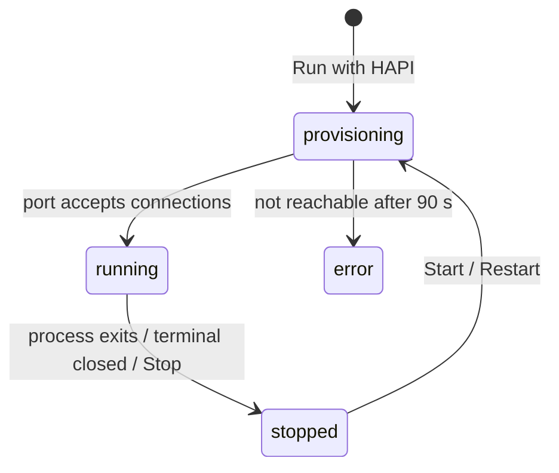

# How OrcA works

This page explains the concepts behind [OrcA](./index.md). For hands-on steps, see the **[VS Code extension guide](../../10-integrations/vscode/index.md)**.

## Contracts

OrcA works with two kinds of contract:

| Kind | Versions | What HAPI makes of it |
| --- | --- | --- |
| **OpenAPI** | 3.x (Swagger 2.0 is detected and flagged) | One MCP tool per operation |
| **Arazzo** | 1.1 (1.0 documents get an upgrade hint) | One MCP tool per workflow |

Contracts are recognized by their **content** (`openapi: 3.x`, `arazzo: 1.x` at the document root), not only by file names, so `api.yaml` works as well as `api.openapi.yaml`. OrcA lists them from two sources:

- **Workspace:** the folders open in VS Code (configurable with `orca.contracts.include` / `exclude`).
- **HAPI Home:** your personal library of specs (see below). A file in both places is listed once, under HAPI Home.

## Outline

The Outline follows the file you are editing and renders it by kind: OpenAPI (info, servers, paths → operations, components, security, tags, `x-hapi`) or Arazzo (source descriptions, workflows → steps, components). Selecting a node selects its exact location in the document, using parser offsets rather than text search, so it stays correct in large specs.

## Dry Run

A dry run asks HAPI which MCP tools it *would* expose, without binding a port:

```bash
hapi serve --dry-run --output <json|markdown|yaml|table> --specs <file>
```

| Format | Use it for |
| --- | --- |
| `json` | A ChatGPT App submission dump (complete it with the `hapi-apps-dump` skill) |
| `markdown` | An AI-agent system-prompt template (complete it with `hapi-agent-prompt-generator`) |
| `yaml` / `table` | Reviewing tool names, descriptions and hints |

OrcA opens the result in an unsaved editor next to the contract. HAPI's warnings (stderr) go to the OrcA output channel, not into the result.

## Local runs

**Run with HAPI** starts `hapi serve --specs <file> --mcp` in a terminal and tracks it as a server:



**Port selection.** HAPI listens on `3000` by default. Before starting, OrcA checks that the port is really free: nothing answers on it, and it can be bound (this also catches services bound to `0.0.0.0`). Ports held by OrcA's other runs count as taken, even before those servers bind them.

- No port given: OrcA moves to the next free port (3001, 3002, …) and notes it.
- Port chosen by you (**Run with Options…**): OrcA asks, offering the next free port.

The MCP endpoint is `http://localhost:<port>/mcp`.

## HAPI Home

HAPI Home is the folder the HAPI CLI uses for specs, configuration, plugins, logs and certificates. OrcA resolves it in this order:

1. The `orca.hapi.home` setting.
2. The `HAPI_HOME` environment variable.
3. `~/.hapi` (`/home/<you>/.hapi`, `/Users/<you>/.hapi`, or `C:\Users\<you>\.hapi`).

OrcA creates the folder if it is missing (the folder only). In WSL, SSH and container windows, the remote machine's home is used, because that is where `hapi` runs.

## Local and remote mode

| | `local` (default) | `remote` |
| --- | --- | --- |
| Network calls | None | The HAPI API (`orca.hapi.apiBaseUrl`) |
| Deploy | Simulated servers on this machine | Real MCP servers; region and plan come from your HAPI profile |
| Sign-in | Optional | Required to deploy, start, stop or delete |

Sessions are stored in VS Code's secret storage, one per mode. Servers started with **Run with HAPI** appear in both modes.

## HAPI CLI

Run and Dry Run need the [HAPI CLI](../hapi-server/hapi-cli.md) v1. When it is missing, OrcA offers to install it with the official installer for your OS, or points you to [hapi.mcp.com.ai](https://hapi.mcp.com.ai).
