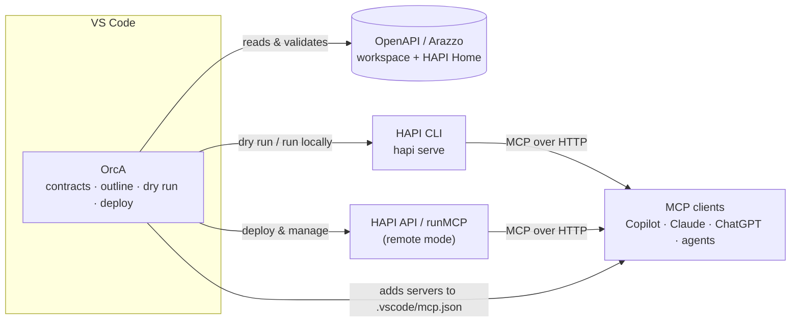

# OrcA: Orchestrator for APIs and Agents

**OrcA** is the IDE component of the HAPI MCP Stack. It brings the whole *API contract → MCP server* journey into your editor: it finds your OpenAPI and Arazzo contracts, lets you explore them, previews the MCP tools an agent will get, runs them locally with the [HAPI CLI](../hapi-server/hapi-cli.md), deploys them, and manages the resulting servers.

:::tip Looking for install steps and how-tos?
OrcA ships as a VS Code extension. See **[VS Code extension (OrcA)](../../10-integrations/vscode/index.md)** for installation, a quickstart and step-by-step guides.
:::

## Why OrcA?

API contracts live in the IDE; MCP servers traditionally live somewhere else. Turning an API into agent tools meant switching between the editor, a terminal, a browser console and the docs, and hoping they still agreed.

OrcA closes that loop:

| Without OrcA | With OrcA |
| --- | --- |
| Hand-written MCP wrappers for every endpoint | Every OpenAPI operation becomes an MCP tool (via HAPI) |
| Guessing which tools an agent will see | **Dry Run** shows the exact MCP tool list first |
| Terminal scripts and port juggling to start servers | **Run with HAPI** picks a free port and tracks the server |
| Separate dashboards to deploy and monitor | **Deploy** and manage MCP servers from the sidebar |
| Multi-step API calls improvised by the LLM | **Arazzo workflows** run as one deterministic MCP tool |

The principle is the same as the rest of the stack: **your API contract is the source of truth**. OrcA adds no code to your API; it helps you author, validate and operate contracts, and delegates execution to HAPI.

## Where OrcA fits in the HAPI stack

| Component | Role | Relationship to OrcA |
| --- | --- | --- |
| [HAPI Server / CLI](../hapi-server/index.md) | Serves OpenAPI and Arazzo documents as MCP servers | OrcA runs it (`hapi serve`) and previews it (`--dry-run`) |
| [runMCP](../runmcp/index.md) | Gateway and hosting for MCP servers | Target of **Deploy** in remote mode |
| [chatMCP](../chatmcp/index.md) | Conversational front end for MCP tools | Consumes the servers OrcA runs or deploys |
| [HAPI Workflows](../hapi-server/hapi-workflows.md) | Arazzo workflows as MCP tools | OrcA authors and validates Arazzo 1.1 documents |

## What OrcA does

- **Contracts:** finds every OpenAPI 3.x and Arazzo 1.1 document by content, in your workspace and your [HAPI Home](./how-it-works.md#hapi-home).
- **Outline:** navigates paths, operations, schemas, workflows and steps, and jumps to the exact line.
- **Dry Run:** previews the MCP tools as JSON (ChatGPT App submission), Markdown (agent system prompt), YAML or a table.
- **Run with HAPI:** starts a local MCP server on a free port, and tracks it until it stops.
- **Deploy and manage:** creates MCP servers from OpenAPI contracts, then starts, stops, restarts and deletes them, and shows their logs. **Add to VS Code** registers a server in `.vscode/mcp.json`.
- **Author Arazzo:** Arazzo 1.1 templates, schema validation in the Problems panel, and export.
- **Connect and chat (v0.3):** OrcA's own MCP client connects to your servers (several at once) and shows their tools, resources and prompts. The **Chat** tab lets an LLM of your choice use them: VS Code language models, OpenAI, Anthropic, Groq, OpenRouter, Ollama, LM Studio or any OpenAI-compatible endpoint (with no vendor SDKs).
- **Traffic analysis (v0.3):** every MCP message and LLM round, drawn as a graph, with filters, native diffs, Copy as cURL, guarded replay, a jump to the contract operation, and session files. A local **capture proxy** records what other clients (Copilot, Claude, ...) send.

Details on each concept: **[How OrcA works](./how-it-works.md)**.

## OrcA and the runMCP extension

OrcA replaces the earlier **runMCP VS Code extension**, which is deprecated; all of its features are in OrcA. This is unrelated to the [runMCP gateway component](../runmcp/index.md), which OrcA deploys to.
