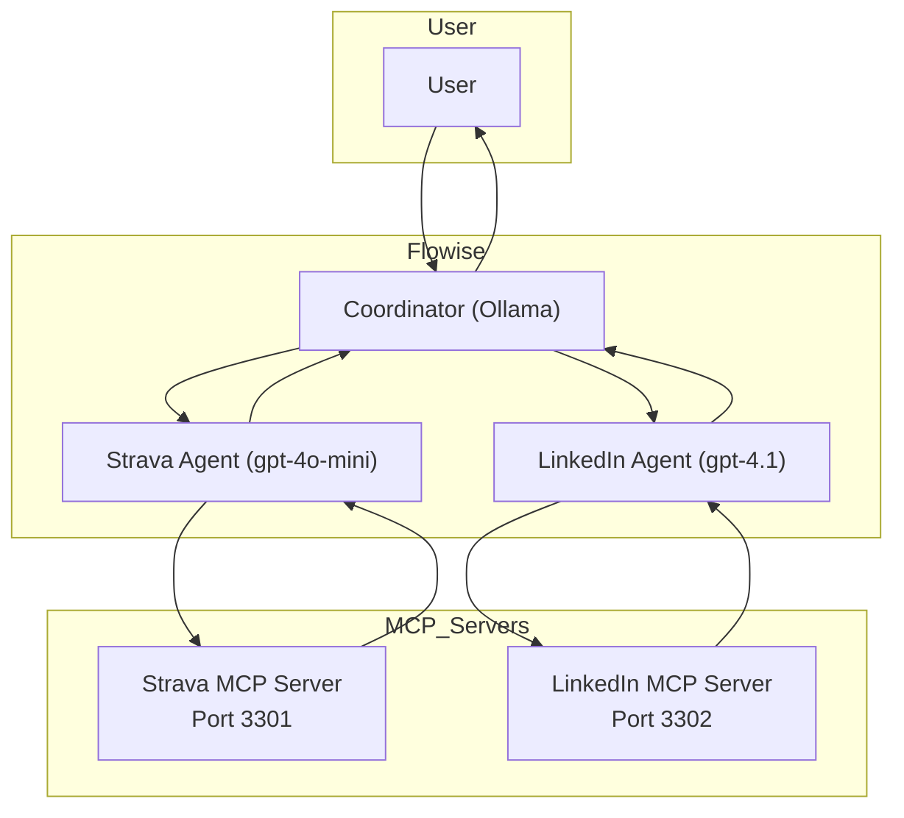
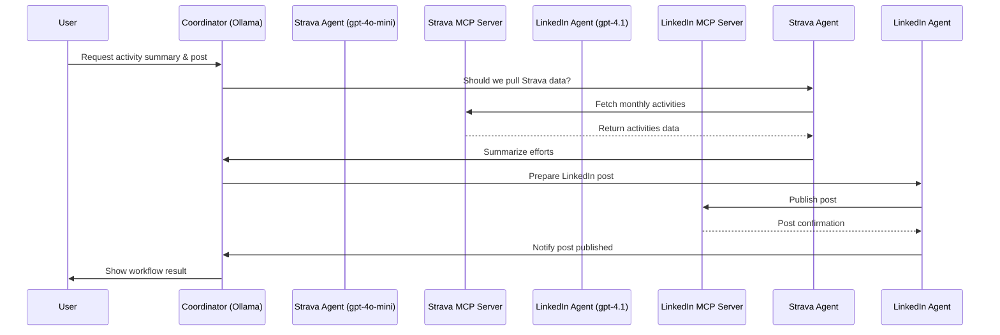

import ReactPlayer from 'react-player'

## Use Case Scenario: Automated Social Media Posting with Flowise Agents

This scenario demonstrates how to leverage Flowise agents and HAPI Server to automate the process of pulling activity data from Strava and sharing a summary post on LinkedIn.

### Overview

- **Goal:** Automatically summarize monthly Strava activities and publish a post on LinkedIn.
- **Tools:** Flowise (for agent workflow), HAPI Server (for API integration with MCP), Ollama (local LLM), OpenAI (for agent LLMs).

### Architecture

### Step-by-Step Workflow

1. **User Initiates Request:**  
   The user requests a summary of their monthly Strava activities and asks to share it on LinkedIn.

2. **Coordinator Agent Decision:**  
   The coordinator agent (Ollama) determines if new Strava data needs to be pulled.

3. **Strava Agent Data Retrieval:**  
   If required, the Strava Agent (gpt-4o-mini) fetches the latest activities from the Strava MCP Server (port 3301).

4. **Activity Summarization:**  
   The Strava Agent analyzes and summarizes the activities, highlighting key efforts.

5. **LinkedIn Agent Posting:**  
   The coordinator passes the summary to the LinkedIn Agent (gpt-4.1), which publishes the post via the LinkedIn MCP Server (port 3302).

6. **Confirmation and Feedback:**  
   The workflow provides feedback to the user, confirming the post was published.

### Sequence Diagram

### Notes & Tips

- **Formatting Posts:**  
  LinkedIn does not support markdown formatting. Ensure the agent generates plain text for posts.

- **Extensibility:**  
  You can easily adapt this workflow to other APIs or social platforms using HAPI Server and Flowise agents.

- **Feedback:**  
  If you know how to improve LinkedIn post formatting via API, please share your insights!

### Demo

<ReactPlayer 
  style={{ width: '80%', height: 'auto', aspectRatio: '4/3' }}
  controls
  src='https://youtu.be/_EYENdNRRSo'
></ReactPlayer>

### Conclusion

This use case demonstrates the power of combining Flowise agents with HAPI Server to automate social media interactions. By leveraging these tools, you can create efficient workflows that save time and enhance user engagement. Explore other potential use cases and APIs to further expand your automation capabilities!